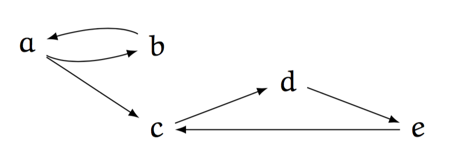

[](https://travis-ci.org/kisp/asgl)
[](http://microbadger.com/images/kisp/asgl)

# ASGL

[ASGL](https://github.com/kisp/asgl#asgl) is an abstract argumentation
solver implemented in
[Embeddable Common Lisp (ECL)](http://cliki.net/ecl) and
[GECODE](http://www.gecode.org/), a toolkit for developing
constraint-based systems and applications. It also features an
interface to the [Lingeling SAT Solver](http://fmv.jku.at/lingeling/)
as an alternative solver backend.  The interface of ASGL conforms to
[ICCMA15](http://argumentationcompetition.org/2015/rules.html).

    Copyright (C) 2015  Kilian Sprotte
    This program comes with ABSOLUTELY NO WARRANTY.
    This is free software, and you are welcome to redistribute it
    under certain conditions.
    
# Example

Given the abstract argumentation framework



and its encoding in Aspartix format

```
arg(a).
arg(b).
arg(c).
arg(d).
arg(e).
att(a,b).
att(b,a).
att(a,c).
att(c,d).
att(d,e).
att(e,c).
```

saved as a file ```af.apx```, we can enumerate all extensions
under the complete semantics with ASGL, using the following command:

```
$ asgl -p EE-CO -fo apx -f "af.apx"
[
  []
, [b]
, [a,d]
]
```

This shows us that the set of complete extensions here is ```{∅,{b},{a,d}}```, solving
the problem ```EE-CO``` for the example argumentation framework.

ASGL reports the problems it can solve via the command:

```
$ asgl --problems
[DC-CO, DC-GR, DC-PR, DC-ST, DS-CO, DS-GR, DS-PR, DS-ST, EE-CO, EE-GR, EE-PR, EE-ST, SE-CO, SE-GR, SE-PR, SE-ST]
```

A problem here is defined as consisting of a computational task and a semantics.

For the computational tasks, we have:

1. ```SE``` Given an abstract argumentation framework, determine some extension
2. ```EE``` Given an abstract argumentation framework, determine all extensions
3. ```DC``` Given an abstract argumentation framework and some argument, decide whether the given argument is credulously inferred
4. ```DS``` Given an abstract argumentation framework and some argument, decide whether the given argument is skeptically inferred

For the semantics, we have:

1.    ```CO``` Complete Semantics
2.    ```PR``` Preferred Semantics
3.    ```GR``` Grounded Semantics
4.    ```ST``` Stable Semantics


Thus, to compute the set of stable extensions, which in this
example is the singleton set ```{{a,d}}```, we solve the problem ```EE-ST``` running the command:

```
$ asgl -p EE-ST -fo apx -f "af.apx"
[
  [a,d]
]
```

For further examples and documentation of the interface, please
refer to [ICCMA15](http://argumentationcompetition.org/2015/rules.html).

# Important files

Dockerfile
: executable instructions to build a [docker](https://www.docker.com/)
container for compiling and running ASGL based on a clean ubuntu image

asgl.lisp
: the main implementation of ASGL

gecode.lisp
: the gecode interface

sat.lisp
: the lingeling interface

BoolSpace.cpp, PrBABSpace.cpp
: GECODE space subclasses needed by ASGL

data/
: AF instances for acceptance tests

features/
: cucumber acceptance tests

lingeling/
: Lingeling SAT Solver

tests/
: unit tests


# Prerequisites

Building ASGL needs a number of prerequisites to be installed
beforehand, which are listed below.

A more precise, executable specification is given in the accompanying
```Dockerfile```. The instructions given there will perform all the
necessary steps based on a clean ubuntu image. This allows for ASGL to
be easily built and run in a [docker](https://www.docker.com/)
container.

## GECODE

A standard installation of GECODE is needed. ASGL is intended to be
used with ```Gecode 4.3.3```.

Float variables are not needed, so they can be excluded in the GECODE
configuration. Installation of GIST ist optional, but ```configure``` needs
to be informed (see below).

## ECL

ASGL requires ```ECL 13.5.1```. As the GECODE interface is realized
using embedded C++ code, ECL needs to be built with a C++ compiler (by
indicating ```--with-cxx```), instead of a C Compiler. This is not the
default, so a standard installation of ECL cannot be used.

The following configuration has proven to be working:
```
./configure \
  --enable-threads --with-cxx --with-dffi=included \
  --enable-boehm=included --with-system-gmp \
  --enable-libatomic=included --enable-unicode
```

## Ragel

A standard installation of
[Ragel](https://en.wikipedia.org/wiki/Ragel) is needed. ASGL has been
successfully built with ```Ragel State Machine Compiler version 6.9
Oct 2014```.

## Cucumber

In order to run the included acceptance tests,
[cucumber](https://cucumber.io/), as well as
[aruba](https://github.com/cucumber/aruba) need to be
installed. During development of ASGL, ```Ruby 1.9.3``` was used.

# Building

## autoconf

Run `autoconf` to create the `configure` script from `configure.ac`.

## configure

Run `./configure`. Depending on your GECODE installation, you might want to pass `--without-gist`.

## generate make .mk files

Run `./scripts/generate-make-mk.sh` to generate ```.mk``` files that
are included by the main ```Makefile```.

## make

Run `make`. After the build finishes successfully, ASGL can be invoked
with ```./bin/asgl```.

## make test

Run ```ASGL_HOME=`pwd` make test``` or alternatively
```ASGL_HOME=`pwd` CUKE_ARGS="--tags '~@slow'" make test``` (skipping
some long running tests).

The unit tests can also be run individually, e.g. by
```ASGL_HOME=`pwd` ./bin/asgl --check tests/tests-quick.lisp ```.

# Docker

There is a docker image automatically built at [Docker Hub](https://hub.docker.com/r/kisp/asgl/builds/).
